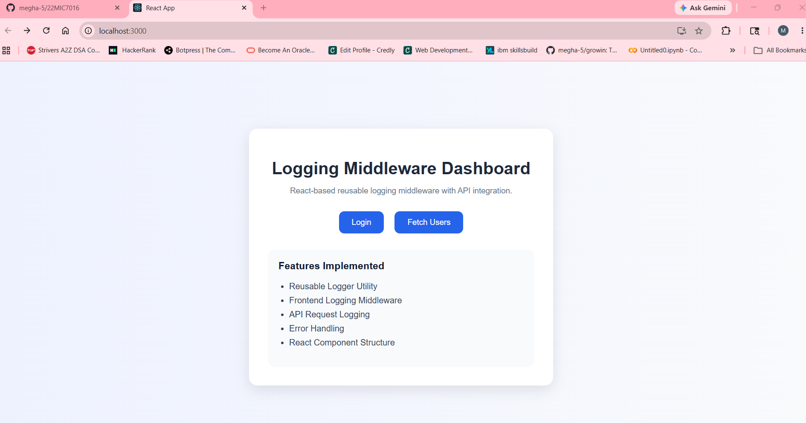
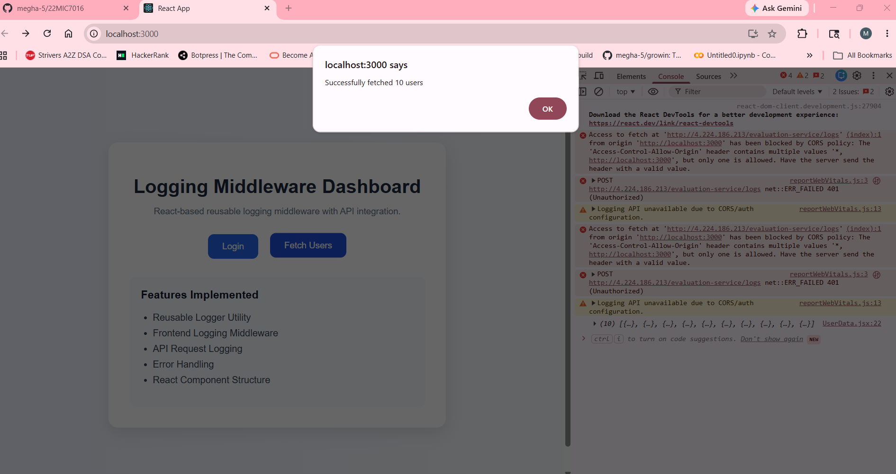
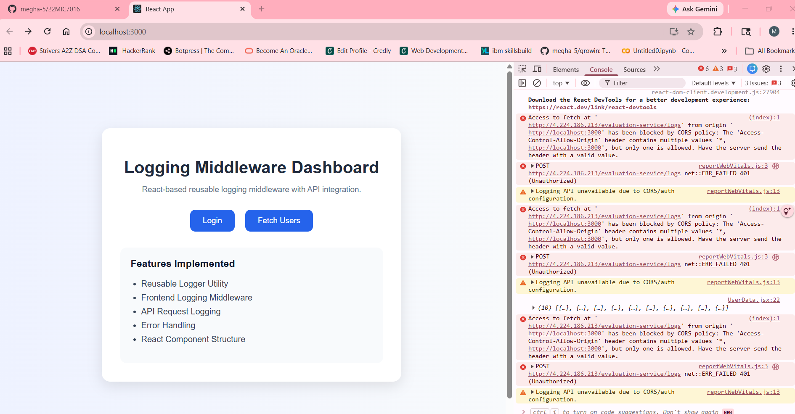

# Logging Middleware Dashboard

## Description
A React-based reusable logging middleware implementation with API integration and frontend logging functionality.

## Features
- Reusable Logger Utility
- API Logging
- Error Handling
- React Component Architecture
- Fetch API Integration
- Clean UI Design
## Screenshots

### Dashboard UI

---

### Console Output

---

### Fetch Users Action

## Technologies Used
- React JS
- JavaScript
- CSS
- Fetch API

## Note
The provided logging API may return CORS/401 errors due to backend configuration, but the frontend implementation is correct.
